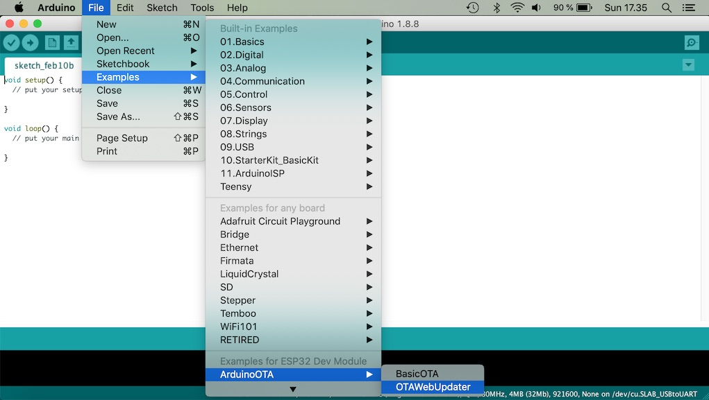
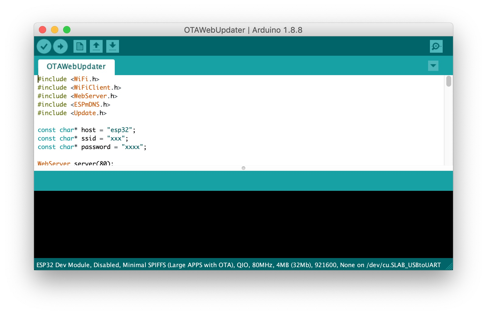
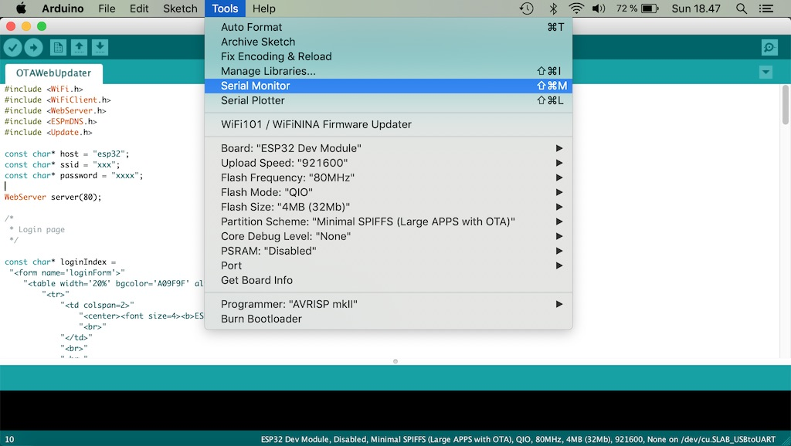
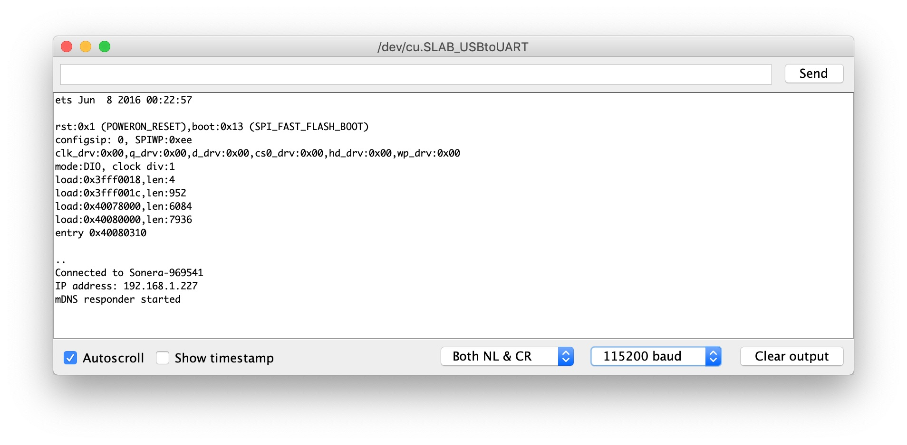
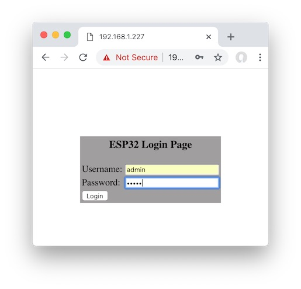
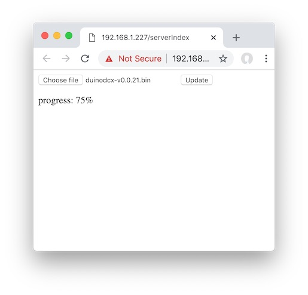
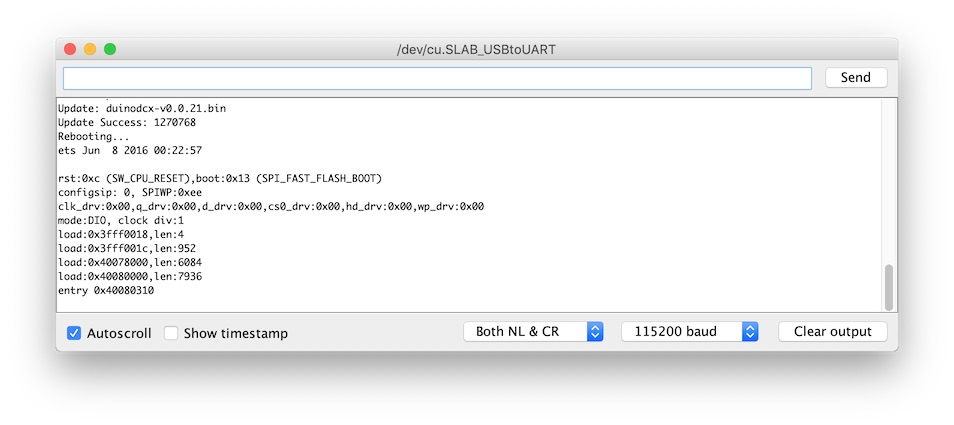

# DuinoDCX User Manual

The intention of this document is to describe the basic steps on how to operate the DuinoDCX controller. The documentation also shows how to set up your hardware using commonly available cheap components. The total cost for building the controller is around 10 dollars if you buy the parts from ebay, aliexpress or similar online store and are not in a hurry.

## Hardware setup
Cheap TTL to RS232 adapters are widely available for a few dollars. Many of them are built using a chinese clone of the MAX3232 chip. The quality varies a lot. Most of these adapters are also designed for DCE use meaning they are normally used together with device that is being controlled. Because of this they have a female DB9 connector. 

As we want to control a another device with  the microcontroller the ESP32 need to act as the data terminal equipment (DTE). Ready made DTE adapters do exist but the prices are a lot higher and the availability is bad. These instructions are for the more popular DCE adapter but the tradeoff is that we need use a RS232 gender changer with it.

### Required parts
#### ESP32 Development board

#### TTL to RS232 adapter

#### Four jumper cables

#### Male to male RS232 gender changer

#### Male to female RS232 Null modem cable

### Wiring 
* RS232 board VCC to ESP32 3.3V
* RS232 board GND to ESP32 3.3V GND
* RS232 board TXD to ESP32 TX2
* RS232 board RXD to ESP32 RX2

Most of the RS232 adapter boards have the TX and RX ports labeled this way. If the connection does not work it’s safe to try the TX and RX cables the other way around. 

Connect the gender changer and the RS232 null modem cable to the RS232 adapter. You should end up with something like this. The pinout of the development boards vary a lot. Many boards have the same footprint but completely different order for the pins. Follow the pin labels, not the physical location of the pins in the picture.

## Flashing the board
Unless you already have the Arduino and Arduino ESP32 core development environments ready you will need to install:
* [Arduino IDE](http://avahi.org/)
* [Arduino ESP32 core]()

Open the Arduino IDE and make sure you have the correct board type selected.

Next select the correct serial port. The port name varies between development boards and operating systems.

Open the OTAWebUpdater sketch from the Examples menu. The OTAWebUpdater will help us to upload the initial version of the firmware to the microcontroller.

Update the ssid and password variables to match your own wifi network credentials.

Open the Serial Monitor under the tools menu.

Now upload the sketch.

When the uploading is done the ESP32 will reboot. When the device gets a wifi connection to the local network it will output the information to the serial monitor. Copy the devices IP address to the clipboard.

Next open the IP address in a browser and login. Username and password are both admin.

Download the latest binary release from https://github.com/lasselukkari/DuinoDCX/releases. Select the file by clicking the Choose file -button and the click Update.

You can also follow the update progress in the serial monitor. 

Once the update is done the device will reboot. The firmware install is now complete.

## Hotspot Access
The controller creates a wifi network with SSID `DCX2496`. The default password is `Ultradrive`.

Connect your computer or mobile device to the network and point the browser to address `http://192.168.4.1`. The default username and password are DCX2496 and Ultradrive. The control panel will take a few seconds to load.

You may need to disable your mobile internet when connected in the hotspot mode.

## Local Network Connection
The downside of the hotspot mode is that the rest of the internet is inaccessible while connected. If you want to make the control panel available in your local network it can be configured in the Wifi Setup config panel.

If there is no local wifi network available you can still create a wifi hotspot using your phone or computer. This way the the controller is accessible while your mobile internet connection still works at the same time. A hotspot device can also be used just to extend the wifi range. 

Select your network name and fill in the password. After submitting the form the controller will attempt to connect to the select network. If the connection is successful the device IP will show up in the Wifi Status panel. This IP address can now be used to access the device inside the local wifi network.

### mDNS
If your client device supports MDNS the controller will be also available at `http://ultradrive.local`. You may need to add `http://` to the url when using it the first time in a browser.
  - For Linux, install Avahi (http://avahi.org/).
  - For Windows, install Bonjour (http://www.apple.com/support/bonjour/).
  - For Mac OSX and iOS support is built in through Bonjour already.
  - For Android there is now way to get mDNS working directly in the browser. The [issue](https://bugs.chromium.org/p/chromium/issues/detail?id=405925&desc=2) has been open since 2014. You can install [Service Browser](https://play.google.com/store/apps/details?id=com.druk.servicebrowser) to discover mDNS services.

## Firmware updates
Open the firmware update panel

If you have connected the controller to a wifi network it will automatically display a download link there is an update available. The latest binary releases are available for download on github: https://github.com/lasselukkari/DuinoDCX/releases 

## Credentials reset
All credentials can be changed using the UI. The defaults are defined beginning of the main sketch file. In case you forget your password short digital pin 13 to the ground for and power up the device. This will restore the default credentials.
