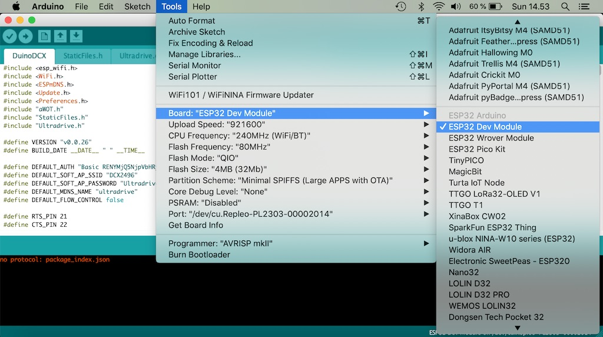

# DuinoDCX User Guide

## Introduction Video

A big thank you for <em>DCX Link</em> for creating the video.

## Online Demo
http://duinodcx.herokuapp.com/

## Table of Contents
1. [Hardware Setup](#1-hardware-setup)
2. [Flashing the Board](#2-flashing-the-board)
3. [Hotspot Access](#3-hotspot-access)
4. [Local Network Connection](#4-local-network-connection)
5. [Firmware Updates](#5-firmware-updates)
6. [Credentials Reset](#6-credentials-reset)

## 1. Hardware Setup
Cheap TTL to RS232 adapters are widely available for a few dollars. Many of them are built using a chinese clone of the MAX3232 chip. The quality varies a lot. Most of these adapters are also designed for DCE use meaning they are normally used together with device that is being controlled. Because of this they have a female DB9 connector. 

As we want to control a another device with  the microcontroller the ESP32 need to act as the data terminal equipment (DTE). Ready made DTE adapters do exist but the prices are a lot higher and the availability is bad. These instructions are for the more popular DCE adapter but the tradeoff is that we need use a RS232 gender changer with it.

### Required parts
#### ESP32 Development board

#### TTL to RS232 adapter

#### Four jumper cables

#### Male to female RS232 null modem cable

#### Male to male RS232 gender changer

Male to male null modem cables are really hard to find. Because of this we need to use a male to male gender changer combined with a female to male null modem cable. Do not buy a cable if you are not sure that it is a null modem cable.

### Wiring 
* RS232 board VCC to ESP32 3.3V
* RS232 board GND to ESP32 GND
* RS232 board TXD to ESP32 TX2
* RS232 board RXD to ESP32 RX2

Most of the RS232 adapter boards have the TX and RX ports labeled this way. If the connection does not work it’s safe to try the TX and RX cables the other way around. 

Connect the gender changer and the RS232 null modem cable to the RS232 adapter. You should end up with something like this. The pinout of the development boards vary a lot. Many boards have the same footprint but completely different order for the pins. Follow the pin labels, not the physical location of the pins in the picture.

### Ultradrive settings
Go to the  `SETUP -> MICELLANIOUS` config page. The `PORT` setting should be either `PC (RS232)` or `PC -> LINK` if you have multiple devices linked.

## 2. Flashing the Board

### Environment

Unless you already have the Arduino and Arduino ESP32 core development environments ready you will need to install:
* [Arduino IDE](https://www.arduino.cc/en/main/software)
* [Arduino ESP32 core 1.0.4](https://github.com/espressif/arduino-esp32#installation-instructions)

It is important that you install the right version of the Arduino ESP32 core.

### Upload process

Download the latest firmaware release from: [https://github.com/lasselukkari/DuinoDCX/releases](https://github.com/lasselukkari/DuinoDCX/releases). You will need the `Source code (zip)` and the StaticFiles.h file located in the release assets. Extract the downloaded zip file and place the `StaticFiles.h` to the `DuinoDCX` directory with the main `DuinoDCX.ino` file.

Next open the `DuinoDCX.ino` file with the Arduino IDE and hook up you development board to the USB port.

If you have the [SerialChiller](https://github.com/lasselukkari/SerialChiller) board you need to follow a few extra steps to make the board boot in the flash mode. Normally when the board starts it runs the application that has been previously flashed. Instead of that we want to make the board run a special program that reads and stores the new firmware that we are about to upload.

To make the [SerialChiller](https://github.com/lasselukkari/SerialChiller) start in the boot mode press and hold the small button on the right side of the ESP32 module while you plug the USB connector to the computer. The button needs to be pressed down when the board gets powered. Once the USB plug has been connected you can release the button.

The [SerialChiller](https://github.com/lasselukkari/SerialChiller) uses a cheap chinece clone of a popular USB to serial port adapter. On Windows people have had problems with the latest official drivers provided by the original manufacturer. These drivers have been reported to work better: [http://www.miklor.com/COM/UV_Drivers.php#install](http://www.miklor.com/COM/UV_Drivers.php#install).

#### Arduino Ide settings
Make sure you have the correct board type selected.

Next select the correct serial port. The port name varies between development boards and operating systems.

Set the partiotion scheme to `Minimal SPIFFS (Large apps with OTA)`

Now upload the sketch.

Once the uploading is completed we are done.

## 3. Hotspot Access
The controller creates a wifi network with SSID `DCX2496`. The default password is `Ultradrive`.

Connect your computer or mobile device to the network and point the browser to address `http://192.168.4.1`. The default username and password are DCX2496 and Ultradrive. The control panel will take a few seconds to load.

You may need to disable your mobile internet when connected in the hotspot mode.

## 4. Local Network Connection
The downside of the hotspot mode is that the rest of the internet is inaccessible while connected. If you want to make the control panel available in your local network it can be configured in the Wifi Setup config panel.

If there is no local wifi network available you can still create a wifi hotspot using your phone or computer. This way the the controller is accessible while your mobile internet connection still works at the same time. A hotspot device can also be used just to extend the wifi range. 

Select your network name and fill in the password. After submitting the form the controller will attempt to connect to the select network. If the connection is successful the device IP will show up in the Wifi Status panel. This IP address can now be used to access the device inside the local wifi network.

### mDNS
If your client device supports MDNS the controller will be also available at `http://ultradrive.local`. You may need to add `http://` to the url when using it the first time in a browser.
  - For Linux, install Avahi (http://avahi.org/).
  - For Windows, install Bonjour (http://www.apple.com/support/bonjour/).
  - For Mac OSX and iOS support is built in through Bonjour already.
  - For Android there is now way to get mDNS working directly in the browser. The [issue](https://bugs.chromium.org/p/chromium/issues/detail?id=405925&desc=2) has been open since 2014. You can install [Service Browser](https://play.google.com/store/apps/details?id=com.druk.servicebrowser) to discover mDNS services.

## 5. Firmware Updates
Open the firmware update panel

If you have connected the controller to a wifi network it will automatically display a download link there is an update available. The latest binary releases are available for download on github: [https://github.com/lasselukkari/DuinoDCX/releases](https://github.com/lasselukkari/DuinoDCX/releases). 

## 6. Credentials Reset
All credentials can be changed using the UI. The defaults are defined beginning of the main sketch file. In case you forget your password short digital pin 13 to the ground for and power up the device. This will restore the default credentials.
